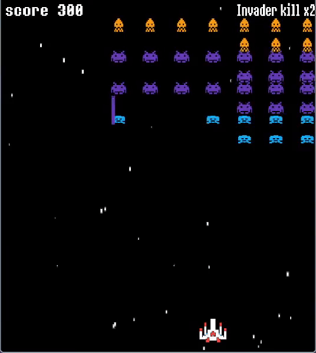

# SDL Space-Invader 👾



## Introduction ⚙️
This is a **Space Invader** game developed in **C** using the **SDL** (Simple DirectMedia Layer) library. It's a classic arcade shooter where you control a spaceship and defend Earth from waves of alien invaders. The objective is to destroy all the invaders before they reach the bottom of the screen!

## Features 💾
- Developed in C using the SDL library.
- Retro-style 2D graphics.
- Dynamic and progressively harder levels.
- Score tracking and high-score system.
- Sound effects and background music.

## How to Play 🕹️
1. Control the spaceship to shoot the alien invaders.
2. The game ends when the invaders reach the bottom or the player's spaceship is destroyed.
3. Aim to get the highest score possible by shooting down enemies.

## Installation ⚒️
### Prerequisites
- Operating System: BSD / macOS / Linux
- SDL2 library installed. [Install SDL2](https://wiki.libsdl.org/Installation)
- A C compiler such as `gcc` or `clang`.
### 📝 Credits

Created by Panha as a high school project to explore the basics of programming and game development.

Special thanks to the creators of SDL2 for the awesome multimedia library that made this project possible!

### Clone the Repository
```bash
git clone https://github.com/your-username/space-invader-sdl.git
cd space-invader-sdl
./build.sh
